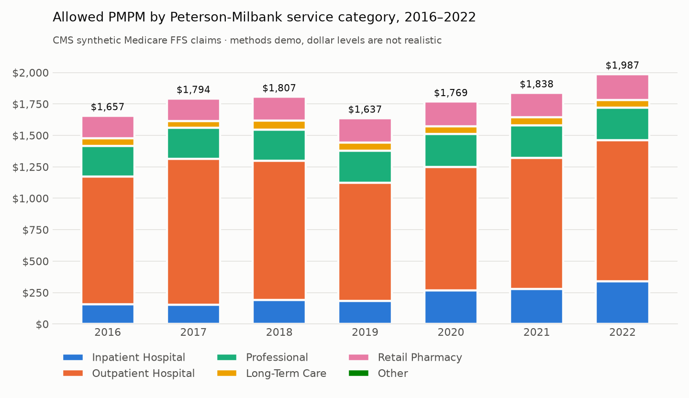
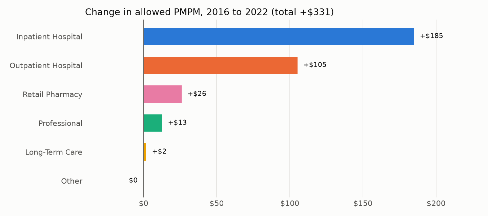

# Medicare Cost Drivers: Standardized Service-Category Spending on CMS Synthetic Claims

Portfolio project for Leo Rule. It applies the published **Peterson-Milbank consensus cost-driver
specifications** to CMS's public **synthetic Medicare FFS claims**. The goal is to show claims methodology end to
end: service-category mapping, member months, PMPM trends, primary care share of spend, and a Part D view of the
drugs selected for Medicare price negotiation.

> Built only from public specifications and public synthetic data. No employer code, logic, or data.

## Results at a glance



- **Total allowed PMPM went from $1,657 (2016) to $1,987 (2022).** Inpatient (+$185) and outpatient (+$105)
  account for most of the growth, so they'd be the first cost drivers to dig into.
- **Primary care is 1.7–2.0% of medical spend** under the Milbank definition. That's low because the synthetic
  carrier file has no office E&M visits (see limitations).
- **All 20 reconciliation checks pass.** The four FLAGs are data limitations in the synthetic file, and the
  pipeline reports them rather than hiding them (`output/validation.csv`).
- **The synthetic data isn't realistic in scale.** Outpatient runs about $1,000 PMPM, and 31% of it is dialysis
  claims. Read these results as a demonstration of the method, not as benchmarks.

Full methodology, judgment calls and limitations are in **[docs/METHODS.md](docs/METHODS.md)**.

## Data
- **CMS Synthetic Medicare Enrollment, FFS Claims, and PDE** (data.cms.gov, 2023 release): 8,671 synthetic
  beneficiaries, enrollment 2015–2025, pipe-delimited. Files: beneficiary, inpatient, outpatient, carrier,
  SNF, HHA, hospice, DME, PDE. The user guide is in `docs/`.
- Specs: the Peterson-Milbank *Consensus Administrative Specifications for Health Care Cost Driver Analyses*
  (service categories, primary care, retail and medical pharmacy) and the *Cost Growth Target* specs, June 2025.
  Download links are in `docs/SOURCES.md`. They aren't redistributed here.
- The full dataset is included, gzipped in `data/raw/*.csv.gz` (~60 MB; ~1.2 GB uncompressed). DuckDB reads the
  .gz files directly, so there's no unzip step. Original source URLs are in `docs/SOURCES.md`.

## Setup
```
python3 -m venv .venv && .venv/bin/pip install -r requirements.txt
.venv/bin/python src/build_db.py          # loads data/raw/*.csv.gz -> data/cost_drivers.duckdb
.venv/bin/python src/run_pipeline.py      # runs sql/01-06, validation checks, writes output/*.csv
.venv/bin/python src/charts.py            # README charts -> output/charts/
.venv/bin/python src/build_twbx.py        # Tableau workbook -> tableau/
```

## Pipeline
| Step | SQL | What it does | Spec section |
|---|---|---|---|
| 1. Member months | `sql/01_member_months.sql` | Beneficiary-months from the monthly arrays: Part A+B, not MA; Part D and dual flags | CGT specs, denominators |
| 2. Standardize claims | `sql/02_claim_lines.sql` | 9 files → one table, allowed $ by file, header dedupe, paid-as-primary flag | Cost driver specs, unit of analysis |
| 3. Service categories | `sql/03_service_categories.sql` | 6 topline categories + subcategories by bill type / POS; eligible-month join | "Defining Service Categories", pp. 5–8 |
| 4. PMPM + growth | `sql/04_pmpm.sql` | PMPM by category and year, year-over-year growth, CAGR, dashboard fact tables | Cost driver analyses |
| 5. Primary care | `sql/05_primary_care.sql` | Spec Steps 1–6: codes, specialty, POS, wellness filter, G0463 split billing, FQHC | "Primary Care Claims Spending", Steps 1–6 |
| 6. Validation | `sql/06_validation.sql` | Row counts, dollar reconciliation, eligibility match, PMPM rebuild, data-quality flags | — |

Next: retail vs. medical pharmacy (J-codes) and Part D spend on the negotiated (Maximum Fair Price) drugs.

## Interactive dashboard (`dashboard/`)
`dashboard/index.html` is a self-contained D3 dashboard. D3 and the data are bundled next to it, so it opens
straight from disk. It includes filters for Medicaid dual status, age band and sex, and every chart recomputes
PMPM from the member-month and spend facts. Also in the dashboard: stacked PMPM by category with a year
drill-down into subcategories, indexed growth by category, primary care share, and the validation checks. It
supports dark mode and has a table view.

## Tableau (`tableau/`)
`Medicare Cost Drivers.twbx` packages `output/tableau_data.csv` with a data source, the PMPM calculations,
four sheets and a dashboard. `src/build_twbx.py` generates it (an unpackaged `.twb` sits next to it for
diffing). PMPM uses `{FIXED [yr] : SUM([ab_mm])}` as the denominator, so the demographic filters are context
filters.

## Outputs (`output/`)
| File | Grain |
|---|---|
| `pmpm_by_category.csv`, `pmpm_total.csv`, `pmpm_growth.csv` | year × service category |
| `primary_care_by_year.csv`, `primary_care_by_service.csv` | year (× service group) |
| `spend_fact.csv` | year × category × subcategory × type of service × dual × age band × sex (allowed, paid, rows, benes) |
| `mm_fact.csv` | year × dual × age band × sex (A+B FFS and Part D member months) |
| `validation.csv` | one row per check |

`spend_fact` and `mm_fact` are the dashboard/Tableau sources. PMPM for any slice is sum(allowed) / sum(member
months) over that slice. Check 6 confirms that rebuilding PMPM from these two tables gives the same numbers as
the SQL.

## Layout
```
data/raw/        source files, gzipped (.csv.gz)
data/*.duckdb    local database (gitignored)
docs/            methods, CMS user guide, sources
ref/             Milbank primary care code lists (Appendix A–C, codes only)
sql/             analysis steps, run in order by src/run_pipeline.py
src/             Python: load, run pipeline, charts, Tableau build
output/          result CSVs and charts
dashboard/       D3 dashboard (index.html + bundled data.js, d3)
tableau/         Tableau packaged workbook
```
